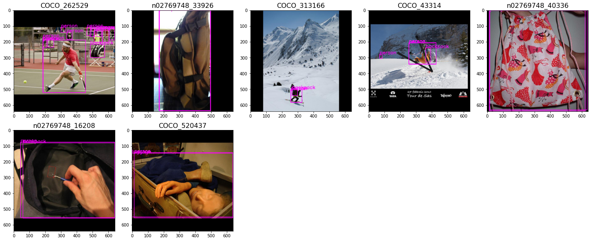
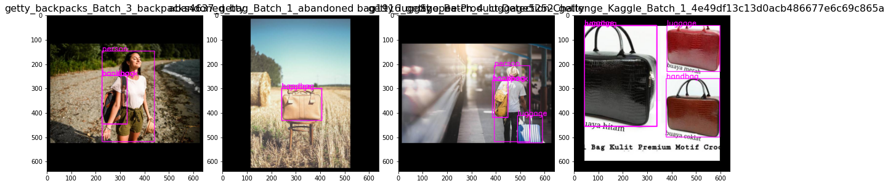
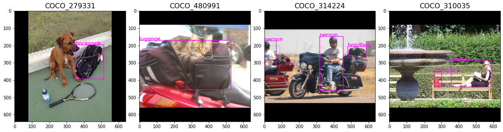
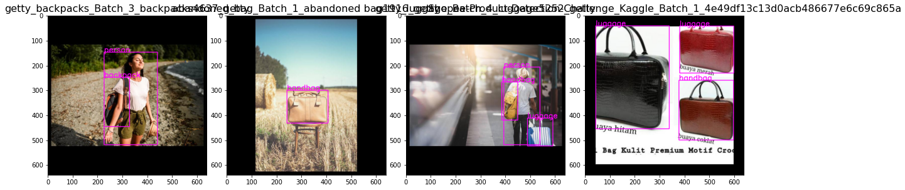

# Remove bounding box duplications - handling duplicated bounding boxes on the same object
Note: This script is created for image dataset with annotations in XML format (pascal VOC format).

This script should comes in handy after the IoU score visualization from iou_score_vis.py.

The function `iou_score_plot(XML_PATH, plot=True)` provides visualization to check if any bounding boxes duplications exist in our image dataset by computing the IoU score between pairs of bounding boxes in an image. High IoU score indicates high overlapping of bounding boxes - we can then decide the IoU threshold for the image dataset.

## `remove_duplicate_bbox.py` for general XML annotations

Run this script will remove duplicated bounding boxes based on the threshold passed in. One thing to take note here: high iou score between the 'person' class and other objects are common especially if objects are attached/held by 'person' in images. Hence, if the 'person' class exist in the XML files, 2 different ways of cleansing the dataset are provided:

1. duplicate bbox without the class 'person'
2. duplicate bbox including the class 'person' ONLY

***Option 1:***

If any duplicated bounding boxes are not of the same object class, the script will require us to enter the class name to keep. For example:
- duplicated bounding boxes of class 'handbag' and 'backpack' on the same object, user to decide either to keep 'handbag' or 'backpack' as the final object class.

***Option 2:***

Mainly deals with bounding box duplications including the class 'person'. By visualizing images with different IoU score, user could set a higher IoU threshold (e.g. > 0.95) when dealing with images with the class 'person' to avoid unnecessary removal of bounding boxes.

## `remove_duplicate_pseudo_bbox.py` for pseudo generated XML annotations

For pseudo generated XML annotations, each bounding box comes with a confidence score. The removal of duplicated bounding boxes will based on the confidence score, i.e. we will only keep the bounding box of the highest confidence score.

### Sample Images:
*images with duplicated bounding boxes involving the 'person' class - IoU score > 0.95:*

*Duplicated bounding boxes:*

*Duplicated bounding boxes (pseudo_annotation):*

*Bounding box duplication removed:*

*Bounding box duplication removed (pseudo_annotation):*

### Future Work
- [ ] To create an interface/platform for user to view and input desired parameters at the same time
- [x] To include pseudo annotations handling (with confidence score)

## Running of Script
Run python file in terminal - XML files which are cleaned will be saved in another folder

`remove_duplicate_bbox.py --xmlpath ./path/to/xmlfiles -t 0.75`